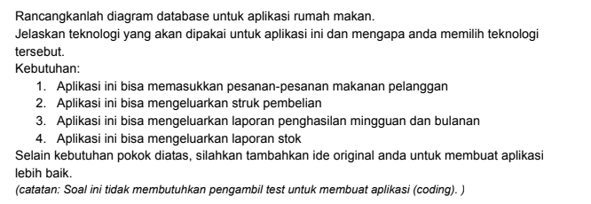
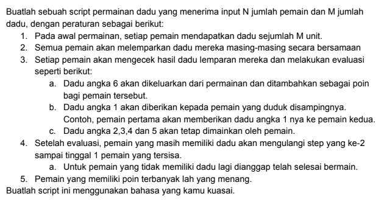

## Soal Teori



### Jawaban


#### Tech Stack

**Client:** ReactJS / NextJS, Redux, Tailwind CSS, git

**Server:** Go, echo/gin, gorm, PostgreSQL, Redis, excelize, JWT, git


## Soal Praktek


### Jawaban
Menjalankan program logic permainan dadu 

```bash
  go run main.go -N=3 -M=4
```
#### Keterangan Flag

- N adalah jumlah pemain

- M adalah jumlah dadu
