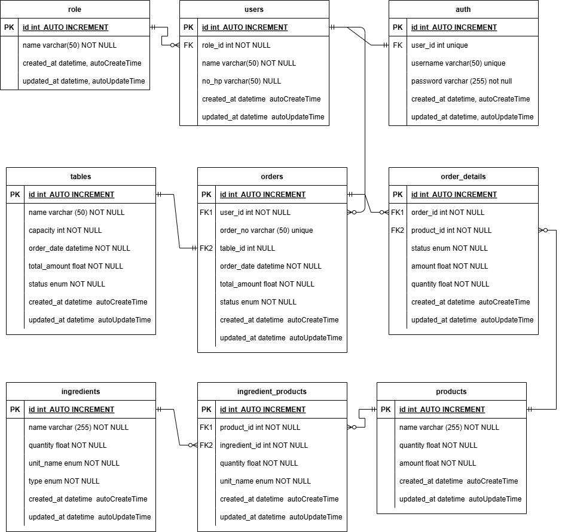

## Soal Teori


### Jawaban

 

#### Tech Stack

**Client:** ReactJS / NextJS, Redux, Material Design / Bootstrap, git

**Server:** Go, echo/gin, gorm, PostgreSQL, Redis, excelize, JWT, git


## Soal Praktek


### Jawaban
Menjalankan program logic permainan dadu 

```bash
  go run main.go -N=3 -M=4
```
#### Keterangan Flag

- N adalah jumlah pemain

- M adalah jumlah dadu


<br/> <br/>
<a href="https://www.adamnasrudin.com" target="_blank">

</a>
